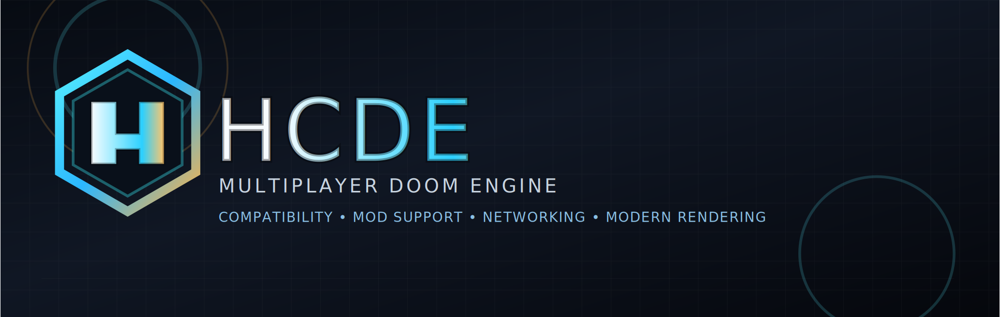

## Welcome to HCDE

HCDE is a Multiplayer Doom engine project focused on compatibility, mod support, networking, and modern rendering.

It is built to stay friendly to classic Doom content while making room for bigger, stranger, and more ambitious addons.

### What it aims to do

- Load classic IWADs and add-ons with as little friction as possible
- Support modern mod formats and compatibility layers
- Keep multiplayer, master-server, and launcher flows easy to diagnose
- Offer both software and hardware rendering paths
- Preserve a clean, debuggable codebase for long-term work

### Getting Started

1. Build HCDE from source.
2. Place your IWADs where the launcher can find them.
3. Run `hcde.exe` and pick the content you want to play.

If you are testing multiplayer, the launcher and server should both be built from the same checkout.

### License

HCDE is licensed under the GNU General Public License, version 3 or later.

See <https://www.gnu.org/licenses/> for the full license text.

Copyright 2025-2026 HCDE Maintainers and Contributors

### Notes

- HCDE is still a fast-moving project, so the public face of the repository may change as the engine settles.
- The logo artwork in `branding/hcde-logo.svg` is the current GitHub banner asset for the project.
